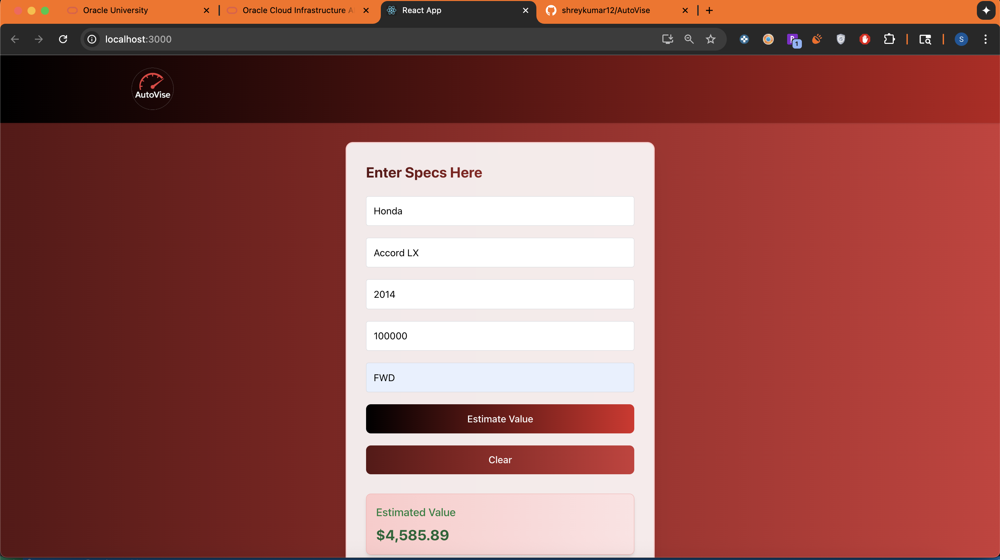

## 🧭 Demo



**AutoVise** is a full-stack machine learning web application that estimates the current market value of a used car based on its specifications. It uses a trained XGBoost regression model and a clean React + Tailwind CSS frontend.

---

## 📦 Features

- Predict current car market value
- Dynamic dropdowns + free text input
- Animated UI with responsive design
- Pretrained ML pipeline with XGBoost
- Input validation and error handling

---

## 🧠 ML Pipeline

- **Frameworks:** scikit-learn + XGBoost
- **Model:** `XGBRegressor`
- **Inputs:** `brand`, `model`, `year`, `mileage`, `drivetrain`, `msrp`
- **Pipeline:** `OneHotEncoder` for categorical + passthrough numeric → `XGBRegressor`
- **Trained on:** 30,000+ real-world car entries

---

## 🔧 Tech Stack

- Frontend: React + Tailwind CSS
- Backend: Flask + Flask-CORS
- ML: scikit-learn, XGBoost, joblib
- Dataset: Expanded_Car_Dataset.csv

---

## 🚀 Getting Started

### Backend
```bash
cd backend
pip install -r requirements.txt
python app.py
```

### Frontend
```bash
cd frontend
npm install
npm start
```

---

## 📁 Project Structure

```
AutoVise/
├── backend/
│   ├── app.py
│   ├── model.pkl
│   └── requirements.txt
├── frontend/
│   ├── public/
│   ├── src/
│   └── package.json
├── data/
│   └── Expanded_Car_Dataset.csv
```

---

---

Made with ❤️ by Shrey Kumar