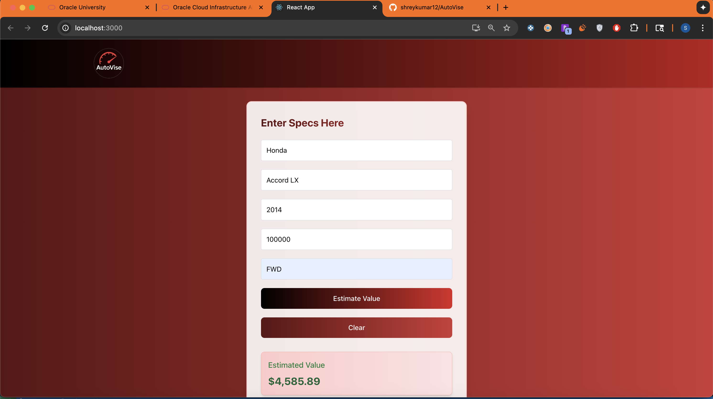

<p align="center">
  Used-car price estimation with an XGBoost model behind a Flask API and a React frontend.
</p>

<p align="center">
  
</p>

## Overview

Enter a car's brand, model, year, mileage and drivetrain, and AutoVise returns an estimated current market value.

You don't need to know the car's original MSRP. The frontend fills it in from a lookup table built from the dataset. If it has no entry for that exact brand, model and year, it averages over the model's other years, then over the brand.

## Model

| | |
|---|---|
| Algorithm | XGBoost regressor in a scikit-learn `Pipeline` |
| Features | brand, model, drivetrain (one-hot) · year, mileage, MSRP |
| Data | 75,000 listings · 13 brands · 41 models · 2005–2024 |
| **R²** | **0.97** on a 20% held-out split |
| **MAE** | **~$1,220** (median car value ≈ $13,900) |

## Stack

**Frontend:** React, Tailwind CSS · **Backend:** Flask · **ML:** scikit-learn, XGBoost, pandas

## Running locally

```bash
# API: serves POST /predict on http://127.0.0.1:5000
cd backend
pip install -r requirements.txt
python app.py
```

```bash
# UI: http://localhost:3000
cd frontend
npm install
npm start
```

To retrain the model on the dataset, run `python train_model.py` from `backend/`. This regenerates `model.pkl`.

## API

```http
POST /predict
Content-Type: application/json

{ "brand": "Honda", "model": "Accord LX", "year": 2016,
  "mileage": 79236, "drivetrain": "FWD", "msrp": 39779 }
```

```json
{ "predicted_value": 4426.09 }
```

## Project structure

```
backend/
  app.py            Flask API
  train_model.py    trains the pipeline and saves model.pkl
  msrpSend.py       builds the MSRP lookup used by the frontend
frontend/src/
  App.js            form, MSRP estimation, API call
data/
  Expanded_Car_Dataset.csv
```
